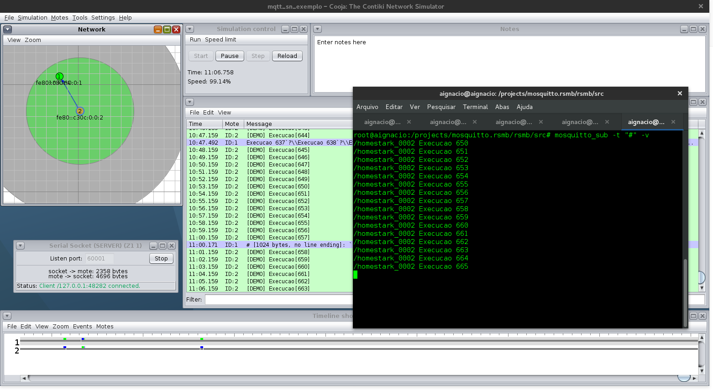

#Porte do MQTT-SN para o Contiki-OS
</br>
__Desenvolvedor:__ Ânderson Ignácio da Silva </br>
Portado parcialmente as características oficiais do protocolo, alguns limitantes
ainda são impostos pelo broker (mosquitto.rsmb).
</br>
__Características:__
- [x] publicação e inscrição com QoS 0
- [x] wildcard (ver observações abaixo)
- [x] função de callback para recebimento de mensagens
- [x] auto-reconexão
- [x] documentação em doxygen
- [x] teste em simulação e cross-compile
- [ ] suporte a QoS -1, 1 e 2
</br>

__Iniciando:__ </br>
Inicialmente recomenda-se testar com o broker em anexo (tools/mosquitto.rsmb)
para o iniciar o broker MQTT-SN com <b>IPv6</b> habilitado:
```make
./broker_mqtts config.mqtt
```
Uma vez iniciado pode-se conectar tanto via <b>TCP (porta 1883)</b>
ou <b>UDP (porta 1884)</b>, recomenda-se manter uma janela de terminal
aberta com inscrição no tópico # utilizando recursos do mosquitto
para visualizar quaisquer pacotes trocados no broker:
```make
mosquitto_sub -t "#" -v
```
__Compilando:__ </br>
Para testar o porte foram realizados testes na ferramenta <b>cooja</b>
com o mote Z1, e com um teste real com o CC2650. Para utilizar a simulação,
abra o cooja dentro de contiki/tools/cooja:
```make
ant run
```
E abra o a simulação dentro de tools/simulacoes (mqtt_sn_exemplo) para testar
compile para o <b>TARGET=z1</b>. É necessário que este repositório esteja
dentro da pasta do contiki para encontrar os diretórios no makefile.
```make
make TARGET=z1
```
Algumas flags foram adicionadas no <b>Makefile</b> para reduzir  o tamanho do firmware gerado.
```make
CFLAGS += -ffunction-sections
LDFLAGS += -Wl,--gc-sections,--undefined=_reset_vector__,--undefined=InterruptVectors,--undefined=_copy_data_init__,--undefined=_clear_bss_init__,--undefined=_end_of_init__
```
Para criar o tunelamento dos pacotes de simulação deve-se utilizar o script <b>webserver_slip.sh</b> (scripts_aux) assim que
a simulação estiver aberta, logo ao criar o adaptador de rede tunelado os pacotes serão redirecionados para o broker
local do mosquitto.rsmb.
</br>


__Teste com dispositivo real(cc2650):__

Para teste com o cc2650 a biblioteca irá adicionar o arquivo <b>lib/newlib/syscalls.c</b>
o qual é utilizado para alocação dinâmica de memória no heap do micro processador
(malloc) através da chamada sbrk do sistema. Um dos detalhes percebidos é de que até o momento deste código
o linker script do CC2650 no Contiki não possui definição de zona de heap, entretanto para utilizar de funções que
utilizem desta zona de memória, insira no linker script do Contiki (contiki/cpu/cc26xx-cc13xx/cc26xx.ld) as linhas abaixo,
no final da chave SECTIONS:
```
...
    _heap = .;
    _eheap = ORIGIN(SRAM) + LENGTH(SRAM);
}
```
A compilação para esse plataforma se dá através do <b>TARGET=srf06-cc26xx</b> para programação também se utiliza da ferramenta
uniflash, a qual deve ser previamente instalada caso haja interesse em programar dispositivos
Texas. Como auxílio para a programação e teste há dois shell scripts (programCC2650.sh e script_init_slip.sh)
onde o primeiro é utilizado para programação do dispositivo através do uniflash tool e o segundo
é utilizado para iniciar o tunelamento de porta, o qual cria o dispositivo tun0 no linux, utilizado
pelo border-router para redirecionar os pacotes enviados e recebidos da rede mesh. Também há um
terceiro script (reset_acm.sh) o qual resseta o módulo do linux utilizado pela conexão dos dispositivos do cc
caso a enumeração ultrapasse valores máximo de alocação do sistema. Todos os scripts estão contidos dentro de
<b>scripts_aux</b>. O target default do makefile do projeto é o cc2650 e para listar demais targets
deve-se utilizar o comando "make targets". Abaixo segue a sequência de comandos para compilar, programar e testar com o CC2650.
Inicia-se pela compilação do rpl-border-router:
```make
cd contiki/examples/ipv6/rpl-border-router
make TARGET=srf06-cc26xx
cd contiki
contiki/MQTT-SN-Contiki---HomeStark/scripts_aux/programCC2650.sh border-router.srf06-cc26xx #Aguardar a programação
#Abrir um novo terminal com broker já aberto(./broker_mqtts config.mqtt)
#Iniciar o tunelamento (criação do tun0)
contiki/MQTT-SN-Contiki---HomeStark/scripts_aux/script_init_slip.sh /dev/ttyACMX #descobrir qual dispositivo está listado ls /dev/tty*, pegar o de menor valor
#Às vezes recomenda-se ressetar a placa do slip caso não aparece o ip atribuído
```
Em um novo terminal, programe o nó com o exemplo padrão:
```make
cd contiki/MQTT-SN-Contiki---HomeStark
make TARGET=srf06-cc26xx all
scripts_aux/programCC2650.sh main_core.elf #Aguardar a programação
```
Assim que o dispositivo for programado ele tentará conectar ao broker e em sequência irá enviar as mensagens direcionadas conforme o
exemplo, o tempo de conexão varia, algo em torno de 10 segundos aproximadamente.

##Observações
1. Se o CC2650 utilizado for o launchpad, ele pode apresentar erro na programação com o Uniflash Tool, tal problema relacionado
com o programador JTAG anexado a placa, para resolver isso, conecte o launchpad a um Windows com o software [SmartRF Flash Programmer v2](http://software-dl.ti.com/dsps/forms/self_cert_export.html?prod_no=flash-programmer-2-1.7.4.zip&ref_url=http://software-dl.ti.com/lprf/flash_programmer_2)
e clique em "update" que após o update da ferramenta, ele irá ser programado no Linux.
2. Toda documentação das funções está em doxygen no caminho MQTT-SN-Contiki---HomeStark/doxy_files/html/index.html.

##Contribuições e licença:
Este software está sendo liberado sobre a licença Apache 2.0, qualquer contribuição deve ser informada ao autor,
criando um branch novo para o feature implementado.
